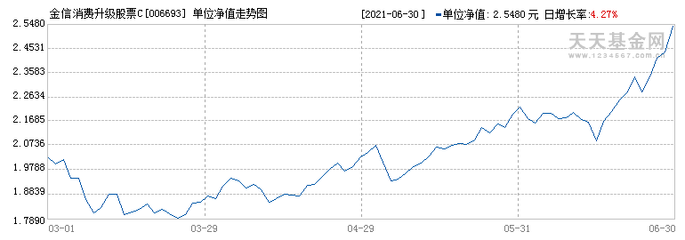

# 基金需求设计

---

## 爬虫设计

* 基金基础数据爬取

## 收益预判

*1.离现在当前日期的距离划分权重,30
2.如果凹点 大于1 取最近凹点
3.增长率方差作为风险等级判断*



---

---


```echarts

{

 "title" : {  
 "text": "收益模拟",  
 "subtext": "纯属虚构"  
 },  
 "tooltip" : {  
 "trigger": "axis"  
 },  
 "toolbox": {  
 "show" : true,  
 "feature" : {  
 "mark" : {"show": true},  
 "dataView" : {"show": true, "readOnly": false},  
 "magicType" : {"show": true, "type": ["line", "bar"]},  
 "restore" : {"show": true},  
 "saveAsImage" : {"show": true}  
 }  
 },  
 "calculable" : true,  
    "xAxis": {
        "type": "category",
            "data": ["2021/7/1", "2021/7/2", "2021/7/3", "2021/7/4", "2021/7/5", "2021/7/6", "2021/7/7"]
    },
    "yAxis": {
        "type": "value"
    },
    "series": [{
        "data": [1200, 1100, 900, 910, 960, 1100, 1320],
        "type": "line"
    }]
}

```
